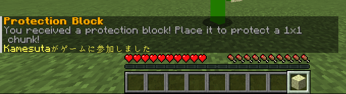
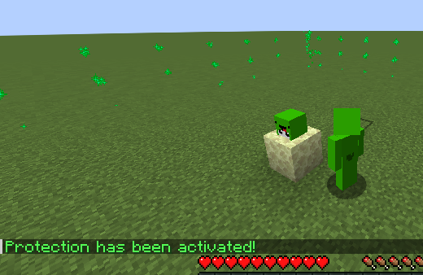
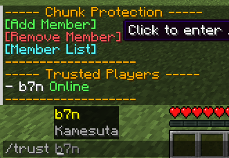

# OneChunkGuard

[English](README_en.md) | 日本語

> 🏆 **直感的で平等な1チャンク保護プラグイン** for Minecraft

OneChunkGuardは、**初心者からマイクラプロまで**誰でも簡単に使えるシンプルな土地保護プラグインです。  
WorldGuard APIを活用し、コマンド不要の直感的操作と便利性を両立させました。

## 🚀 なぜOneChunkGuardを選ぶべきか？

### ✨ **シンプルな使いやすさ**
- 🎯 **コマンドがなくても簡単保護** - ブロックを置くだけで即座に保護
- 🎁 **自動配布システム** - 新規プレイヤーに保護ブロックを自動配布
- 👀 **視覚的フィードバック** - プレイヤーヘッド表示で所有者が一目瞭然。チャンクに入ったときにアクションバーで所有者を表示
- ✨ **チャンクビジュアライザー** - パーティクルでチャンク境界を表示

### 🛡️ **柔軟な保護システム**
- 🏗️ **複数保護ブロック種類対応** - 区画に応じてスポーン区画(1x1チャンク)、VIP区画(3x3チャンク)など多層保護可能
- 📐 **可変チャンク範囲** - 1x1からNxNまで自由に設定可能
- 🏛️ **親リージョン制限** - 特定エリア専用の保護ブロック設定
- 🔄 **独立保護管理** - 区画ごとに独立した保護の作成・解除

### 👥 **共同作業機能**
- 🤝 **高度な信頼システム** - プレイヤー単位での細かい権限管理
- 💬 **インタラクティブTUI** - 右クリックで表示される直感的メニュー
- 🎮 **直感的な設定** - 保護ブロックの右クリックとプレイヤー名の入力だけで共同プレイヤーを設定可能

## 📋 必要な環境

- **Minecraft**: 1.20以降 | **Java**: 21+
- **サーバー**: Spigot/Paper
- **依存プラグイン**: 
  - WorldGuard 7.0+
  - WorldEdit 7.2+

## 🚀 インストール方法

1. [Releases](https://github.com/kamesuta/OneChunkGuard/releases)から最新版をダウンロード
2. `plugins`フォルダに`OneChunkGuard-X.X.X.jar`を配置
3. サーバーを再起動
4. プラグインが正常に読み込まれたことを確認

## 🎯 使い方（とってもシンプル！）

### ✨ **3ステップで完了！コマンド不要！**

#### 🔥 **1. サーバーに参加**


サーバーに初めて参加すると、**ホットバー9番目に保護ブロックが自動配布**されます。
何もする必要なし！すぐに土地保護が始められます。

#### 🏠 **2. 保護したい場所にブロックを置く**


保護したい場所に保護ブロックを設置するだけ。
- 設置した瞬間に**1チャンク(16x16ブロック)が保護**されます
- 上にプレイヤーヘッドが自動で設置され、**所有者が一目瞭然**
- パーティクルでチャンク境界が表示されるので、**保護範囲がすぐわかる**

#### 👥 **3. 仲間と共有（オプション）**


保護ブロックを**右クリック**すると、直感的なメニューが表示：
- **[メンバー追加]** をクリック → `/trust プレイヤー名` が自動入力
- **[メンバー一覧]** をクリック → 信頼プレイヤー一覧表示
- **[メンバー削除]** をクリック → `/untrust プレイヤー名` が自動入力

### 📱 **スマホのように簡単な操作**

| 操作 | 方法 | 結果 |
|------|------|------|
| 🏠 **土地保護** | ブロックを置く | 即座に1チャンク保護 |
| 👥 **仲間追加** | 右クリック→メニュー | 2クリックで完了 |
| 🔓 **保護解除** | ブロックを壊す または `/unprotect` | ブロック返却＆保護解除 |
| 👁️ **所有者確認** | チャンクに入る | アクションバーに表示 |

### 💎 **コマンド一覧（覚える必要なし！）**

基本的にはコマンドを覚える必要はありませんが、以下のコマンドも使えます：

| コマンド | 説明 | こんな時に |
|---------|-----|----------|
| `/unprotect` | 保護解除してブロック回収 | 遠くから解除したい時 |
| `/trust Steve` | Steveを信頼プレイヤーに | 右クリックメニューが面倒な時 |
| `/untrust Steve` | Steveを信頼リストから削除 | 右クリックメニューが面倒な時 |
| `/trustlist` | 信頼プレイヤー一覧表示 | 誰を追加したか忘れた時 |

### 🎮 **実際の使用例**

```
🎯 ケース1: 一人で建築
1. 建築したい場所に保護ブロックを設置
2. 完了！あとは自由に建築

🤝 ケース2: 友達と共同建築  
1. 保護ブロックを設置
2. ブロックを右クリック
3. [メンバー追加] をクリック
4. 友達の名前を入力してEnter
5. 完了！友達も建築可能

🔄 ケース3: 別の場所に移住
1. 古い保護ブロックを破壊（自動回収）
2. 新しい場所に設置
3. 完了！
```

### 🛠️ **管理者コマンド**

サーバー管理者向けの高度なコマンドも用意しています：

| コマンド | 説明 | 使用例 |
|---------|-----|--------|
| `/giveprotectionblock <player> <type> [amount]` | 指定プレイヤーに保護ブロックを配布 | `/giveprotectionblock Steve vip 1` |
| `/giveprotectionblock <player>` | デフォルト保護ブロックを配布 | `/giveprotectionblock Steve` |

**管理者コマンドの特徴：**
- 🎯 **セレクター対応** - `@p`, `@a`, `@r` などのMinecraftセレクターが使用可能
- 🎁 **複数種類のブロック配布** - default, vip など設定した種類を指定可能

**権限設定：**
- `onechunkguard.admin` - 管理者コマンドの使用権限
- `onechunkguard.give` - 保護ブロック配布コマンドの使用権限

## ⚙️ 設定

`plugins/OneChunkGuard/config.yml`で設定をカスタマイズできます：

```yaml
# 保護ブロックの設定
protection-block:
  material: END_STONE          # 保護ブロックの素材
  display-name: "&6&l保護ブロック"
  lore:
    - "&7このブロックを設置すると"
    - "&7チャンクが保護されます"
    - "&c1人1チャンクまで！"

# 保護設定
protection:
  min-y: -64                   # 保護する最低高度
  max-y: 320                   # 保護する最高高度
  max-trusted-players: 5       # 最大信頼プレイヤー数

# メッセージ設定（カスタマイズ可能）
messages:
  protection-created: "&a保護が有効になりました！"
  # ... その他のメッセージ
```

## 🔧 開発・ビルド

### 必要な環境
- Java 21以降
- Maven 3.8以降

### ビルド方法
```bash
git clone https://github.com/kamesuta/OneChunkGuard.git
cd OneChunkGuard
mvn clean package
```

ビルドされたJARファイルは`target/onechunkguard-X.X.X.jar`に生成されます。

## 🐛 バグ報告・機能要望

バグを発見した場合や新機能の要望がある場合は、[GitHub Issues](https://github.com/kamesuta/OneChunkGuard/issues)でお知らせください。

## 📜 ライセンス

このプロジェクトはMITライセンスの下で公開されています。詳細は[LICENSE](LICENSE)ファイルをご覧ください。

## 🙏 謝辞

- [WorldGuard](https://github.com/EngineHub/WorldGuard) - 土地保護システムの基盤
- [WorldEdit](https://github.com/EngineHub/WorldEdit) - WorldGuardの依存関係
- [Spigot/Paper](https://papermc.io/) - Minecraftサーバープラットフォーム
