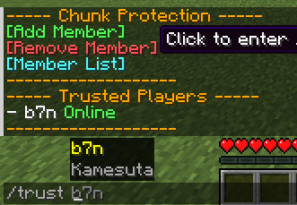

# OneChunkGuard

<div align="center">


[](https://modrinth.com/plugin/onechunkguard)
[](https://github.com/kamesuta/OneChunkGuard/releases)
[](https://bstats.org/plugin/bukkit/OneChunkGuard/26619)
[](LICENSE)

</div>

English | [日本語](README.md)

> 🏆 **Just Place a Block - 1 Chunk Protection Plugin** for Minecraft

OneChunkGuard is a simple land protection plugin that **anyone from beginners to Minecraft pros** can use easily.  
Leveraging the WorldGuard API, it combines intuitive no-command operation with convenience.

## 🚀 Why Choose OneChunkGuard?

### 🎮 **Full Survival Mode Support**
- ⚔️ **No OP Required** - Regular players can protect their land
- 🏗️ **Survival or Creative** - Works in any game mode
- 🎯 **Fair System** - Everyone can protect the same amount (1 chunk)

### ✨ **Simple Usability**
- 🎯 **Easy Protection Without Commands** - Just place a block for instant protection
- 🎁 **Automatic Distribution System** - Protection blocks automatically given to new players
- 👀 **Visual Feedback** - Player head display shows owner at a glance. Owner shown in action bar when entering chunks
- ✨ **Chunk Visualizer** - Particles display chunk boundaries

### 🛡️ **Flexible Protection System**
- 🏗️ **Multiple Protection Block Types** - Multi-layer protection like spawn areas (1x1 chunk), VIP areas (3x3 chunks) (configurable)
- 📐 **Variable Chunk Range** - Freely configurable from 1x1 to NxN
- 🏛️ **Parent Region Restrictions** - Protection blocks for specific areas only
- 🔄 **Independent Protection Management** - Create and remove protection independently by area type

### 👥 **Collaboration Features**
- 🤝 **Advanced Trust System** - Fine permission management per player
- 💬 **Interactive TUI** - Intuitive menu displayed on right-click
- 🎮 **Intuitive Setup** - Set co-players with just right-click and player name input

## 📋 Requirements

- **Minecraft**: 1.20+ | **Java**: 21+
- **Server**: Spigot/Paper
- **Dependencies**: 
  - WorldGuard 7.0+
  - WorldEdit 7.2+

## 🚀 Installation

1. Install [WorldGuard](https://modrinth.com/plugin/worldguard) and [WorldEdit](https://modrinth.com/plugin/worldedit)
2. Download the latest version from [Releases](https://github.com/kamesuta/OneChunkGuard/releases)
3. Place `OneChunkGuard-X.X.X.jar` in the `plugins` folder
4. Restart the server
5. Confirm the plugin loaded successfully

## 🎯 How to Use (So Simple!)

### ✨ **Complete in 3 Steps! No Commands Needed!**

#### 🔥 **1. Join the Server**


When you first join the server, a **protection block is automatically placed in hotbar slot 9**.
Nothing to do! You can start protecting land immediately.

#### 🏠 **2. Place the Block Where You Want to Protect**


Just place the protection block where you want to protect.
- The moment you place it, **1 chunk (16x16 blocks) is protected**
- A player head is automatically placed on top, **owner clearly visible**
- Particles show chunk boundaries, so you **instantly see the protected area**

#### 👥 **3. Share with Friends (Optional)**


**Right-click** the protection block to display an intuitive menu:
- **[Add Member]** click → `/trust playername` auto-filled
- **[Remove Member]** click → `/untrust playername` auto-filled
- **[Member List]** click → Shows trusted player list

### 📱 **As Easy as a Smartphone**

| Action | Method | Result |
|--------|--------|--------|
| 🏠 **Land Protection** | Place block | Instant 1-chunk protection |
| 👥 **Add Friend** | Right-click→Menu | Complete in 2 clicks |
| 🔓 **Remove Protection** | Break block or `/unprotect` | Block returned & protection removed |
| 👁️ **Check Owner** | Enter chunk | Shown in action bar |

### 💎 **Command List (No Need to Memorize!)**

While you don't need to memorize commands, these are available:

| Command | Description | When to Use |
|---------|-------------|-------------|
| `/unprotect` | Remove protection & return block | When removing from afar |
| `/trust Steve` | Add Steve as trusted player | When menu is inconvenient |
| `/untrust Steve` | Remove Steve from trusted list | When menu is inconvenient |
| `/trustlist` | Show trusted player list | When you forgot who you added |

### 🎮 **Real Usage Examples**

```
🎯 Case 1: Building Alone
1. Place protection block where you want to build
2. Done! Build freely

🤝 Case 2: Building with Friends  
1. Place protection block
2. Right-click the block
3. Click [Add Member]
4. Enter friend's name and press Enter
5. Done! Friend can build too

🔄 Case 3: Moving to a New Location
1. Break old protection block (auto-collected)
2. Place in new location
3. Done!
```

### 🛠️ **Admin Commands**

Advanced commands for server administrators:

| Command | Description | Example |
|---------|-------------|---------|
| `/giveprotectionblock <player> <type> [amount]` | Give protection blocks to player | `/giveprotectionblock Steve vip 1` |
| `/giveprotectionblock <player>` | Give default protection block | `/giveprotectionblock Steve` |

**Admin Command Features:**
- 🎯 **Selector Support** - Minecraft selectors like `@p`, `@a`, `@r` can be used
- 🎁 **Multiple Block Type Distribution** - Can specify configured types like default, vip

**Permission Settings:**
- `onechunkguard.admin` - Admin command usage permission
- `onechunkguard.give` - Protection block distribution command permission

## ⚙️ Configuration

Customize settings in `plugins/OneChunkGuard/config.yml`:

```yaml
# Protection Block Settings
protection-block:
  material: END_STONE          # Protection block material
  display-name: "&6&lProtection Block"
  lore:
    - "&7Place this block to"
    - "&7protect a chunk"
    - "&cOne chunk per person!"

# Protection Settings
protection:
  min-y: -64                   # Minimum protection height
  max-y: 320                   # Maximum protection height
  max-trusted-players: 5       # Maximum trusted players

# Messages (Customizable)
messages:
  protection-created: "&aProtection activated!"
  # ... other messages
```

## 🔧 Development & Building

### Requirements
- Java 21+
- Maven 3.8+

### Build Instructions
```bash
git clone https://github.com/kamesuta/OneChunkGuard.git
cd OneChunkGuard
mvn clean package
```

The built JAR file will be generated at `target/onechunkguard-X.X.X.jar`.

## 🐛 Bug Reports & Feature Requests

If you find a bug or have a feature request, please let us know at [GitHub Issues](https://github.com/kamesuta/OneChunkGuard/issues).

## 📜 License

This project is released under the MIT License. See the [LICENSE](LICENSE) file for details.

## 📊 Statistics

This plugin uses [bStats](https://bstats.org/plugin/bukkit/OneChunkGuard/26619) to collect anonymous usage statistics.
The statistics are collected anonymously and help improve the plugin.

If you wish to disable statistics collection, you can do so in `plugins/bStats/config.yml`.

## 🙏 Acknowledgments

- [WorldGuard](https://github.com/EngineHub/WorldGuard) - Foundation of the land protection system
- [WorldEdit](https://github.com/EngineHub/WorldEdit) - WorldGuard dependency
- [Spigot/Paper](https://papermc.io/) - Minecraft server platform
- [bStats](https://bstats.org/) - Plugin usage statistics service